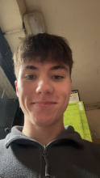

# ELE2025 - Autonumous Line-Following Machine Project

## Weekly Design Report

### [David Gardiner](mailto:dgardiner04@qub.ac.uk)

| Image | Week | Progress |
|-------|------|----------|
|  | 16/01/24 | Met with team; |

### [Jude Hinds](mailto:jhinds04@qub.ac.uk)

| Image | Week | Progress |
|-------|------|----------|
|  | 16/01/24 | Met with team; chosen as team leader; appointed as Programming Lead |

### [Oran Farrell](mailto:ofarrell03@qub.ac.uk)

| Image | Week | Progress |
|-------|------|----------|
|  | 16/01/24 | Met with team; |

### [Conrad Quinn](mailto:cquinn167@qub.ac.uk)

| Image | Week | Progress |
|-------|------|----------|
|  | 16/01/24 | Met with team; |
